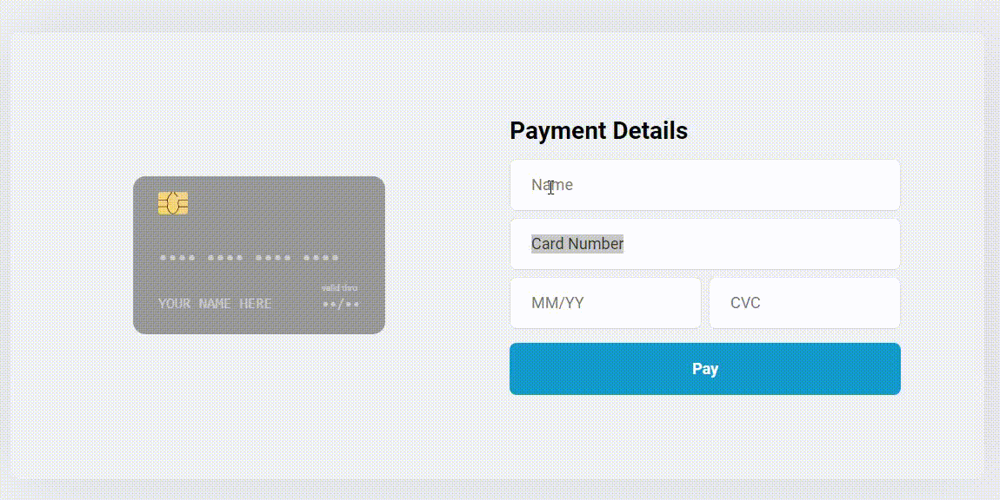

# Credit-card-demo
> Está é uma aplicação simples de estudo desenvolvida com ReactJs onde a mesma executa a animação na hora de fazer o pagamento.

[![NPM Version][npm-image]][npm-url]
[![Build Status][travis-image]][travis-url]
[![Downloads Stats][npm-downloads]][npm-url]

De um a dois parágrafos sobre o que é seu projeto e o que ele faz.



## Instalação

```sh
npm install
```

## Execut

```sh
npm start
```

## Contributing

1. Faça o _fork_ do projeto (<https://github.com/Bruno-Goudric/credit-card-demo/fork>)
2. Crie uma _branch_ para sua modificação (`git checkout -b feature/fooBar`)
3. Faça o _commit_ (`git commit -am 'Add some fooBar'`)
4. _Push_ (`git push origin feature/fooBar`)
5. Crie um novo _Pull Request_

[npm-image]: https://img.shields.io/npm/v/datadog-metrics.svg?style=flat-square
[npm-url]: https://npmjs.org/package/datadog-metrics
[npm-downloads]: https://img.shields.io/npm/dm/datadog-metrics.svg?style=flat-square
[travis-image]: https://img.shields.io/travis/dbader/node-datadog-metrics/master.svg?style=flat-square
[travis-url]: https://travis-ci.org/dbader/node-datadog-metrics
[wiki]: https://github.com/Bruno-Goudric/credit-card-demo/wiki
